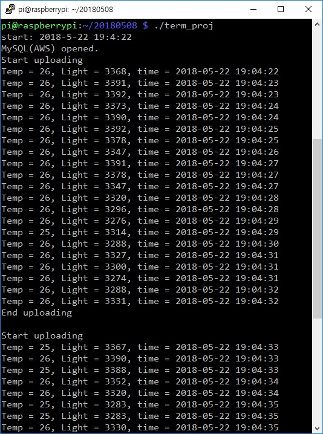

### [YouTube Link](https://www.youtube.com/watch?v=m2MxSjajOAo)
```
https://www.youtube.com/watch?v=m2MxSjajOAo
```

### How to use

* For example
  
```
#You can determine the interval of uploading to MySQL server by argument vector
$ a.out 1
  ...
$ a.out 10
  ...
```  

```
#Or you can use just default interval as 10 seconds.
$ a.out
```

### Server
* AWS-EC2
* Apache
* PHP
* MySQL
* Ajax


### Raspberry pi
* Sending data to server in each interval.




### Web view
* Line chart in PHP


